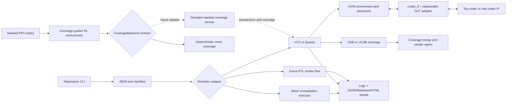

# Configurable Video Codec Verification Platform

A runnable, reusable verification prototype for configurable video-codec IP. It combines a
SystemVerilog/UVM environment, a replaceable behavioral codec DUT, simulator-neutral regression
automation, functional and code-coverage workflows, and an action-masked PPO stimulus generator.

The project is intentionally codec-standard-neutral: it verifies an abstract ready/valid codec
protocol without proprietary specifications or IP. The included deterministic DUT makes checking,
negative testing, reset recovery, and automation executable; the DUT-facing adapter can be replaced
without rewriting the reusable UVM environment.

## Project background and acknowledgments

This project was developed from September 2023 through September 2024 during my internship at
NETINT in Toronto. I gratefully acknowledge Peter Wu, my supervisor at NETINT, for his guidance,
help, and support throughout the project.

## Architecture



Inside UVM, sequences feed the sequencer and driver. The monitor independently publishes accepted
requests, responses, and resets. Requests pass through the reference model into the scoreboard's
expected queue; responses enter its actual side; all observations feed functional coverage. The
top-level protocol checker observes the same interface. See [Architecture](docs/architecture.md),
[coverage plan](docs/coverage-plan.md), and [RL design](docs/rl-design.md) for the detailed contracts.

## What is included

- UVM 1.2-style transaction, sequencer, driver, monitor, active/passive agent, environment,
  reference model, scoreboard, functional coverage, tests, and reusable sequences.
- Five representative UVM tests: normal, constrained-random, backpressure/latency, active-reset
  recovery, and invalid input/configuration handling.
- SystemVerilog assertions for handshake persistence, stability, ordering, legal state changes,
  reset, backpressure, timeout, and invalid transitions.
- A simulator-neutral Python runner with VCS, Questa/ModelSim, optional Icarus, and mock adapters.
- Strict manifest validation, deterministic or random seeds, parallel execution, per-test timeouts,
  fixed-seed reruns, artifact collection, failure detection, and explicit result provenance.
- VDB/UCDB command generation and mock coverage merging, plus JSON, Markdown, HTML, and terminal
  reports.
- A Gymnasium-compatible RL environment with 135 discrete codec actions, dynamic masks, 90 mock
  coverage goals, explicit rewards, deterministic seeds, metrics, checkpoints, evaluation, and a
  constrained-random comparison.
- Unit tests for all Python subsystems.

## Repository layout

```text
rtl/                    behavioral protocol package and toy codec DUT
tb/
  interfaces/           replaceable codec interface
  adapters/             toy-DUT-specific pin mapping and predictor
  agents/               item, sequencer, driver, monitor, active/passive agent
  sequences/            base, directed, random, backpressure, reset, error, corner
  env/                   configuration, environment, reference model
  scoreboard/            expected-versus-actual checking
  coverage/              functional covergroups and crosses
  assertions/            protocol SVA
  tests/                 reusable base test and five representative tests
  top/                   simulator/UVM top
  smoke/                 lightweight non-UVM smoke benches
sim/
  manifests/             shared test/suite and source manifests
  vcs/                    VCS notes
  questa/                 Questa notes
regression/               runner, adapters, failure detection, coverage, reports
rl/                       actions, masks, environment, backends, PPO workflows
config/                   simulator tool-variable inventory
scripts/                  setup, regression entry point, repository audit
tests/                    Python unit tests
docs/                     plans, architecture, coverage, RL, validation
outputs/                  ignored generated results only
```

Generated build trees, logs, waves, coverage databases, reports, and model checkpoints stay under
`outputs/` by default and are ignored by Git.

## Prerequisites and setup

The portable core requires Python 3.10 or newer, `venv`, and GNU Make (optional). NumPy is the only
required Python runtime dependency. Licensed UVM runs additionally require a supported VCS or
Questa/ModelSim installation with UVM 1.2 and the vendor license environment configured. Icarus is
optional and runs only the non-UVM RTL smoke flow.

Create a development environment:

```bash
./scripts/bootstrap.sh
. .venv/bin/activate
python -m unittest discover -s tests -v
python -m ruff check regression rl scripts tests
python -m ruff format --check regression rl scripts tests
python -m mypy regression rl scripts tests
```

For PPO training, install the optional Gymnasium, Stable-Baselines3, SB3-Contrib, and transitive
PyTorch dependencies:

```bash
./scripts/bootstrap.sh --rl
. .venv/bin/activate
```

`PYTHON=/path/to/python` and `VENV=/path/to/venv` customize the bootstrap script. After setup,
activate the environment or call Make as `make PYTHON=.venv/bin/python test`; Make does not select
the virtual-environment interpreter automatically.

## Tests and manifest configuration

The default manifest is [`sim/manifests/regression.json`](sim/manifests/regression.json). Run the CLI
from the repository root, or pass an absolute `--manifest` path. Discover tests with:

```bash
python3 scripts/regress.py list
python3 scripts/regress.py list --suite nightly
```

The named suites are:

| Suite | Purpose |
|:--|:--|
| `smoke` | normal and invalid UVM tests |
| `nightly` | all five UVM tests; use this as the complete licensed-simulator UVM regression |
| `stress` | random, backpressure, and reset-recovery tests |
| `portable` | non-UVM RTL smoke test for Icarus |

The top level accepts `schema_version`, `project_root`, `defaults`, `simulators`, `suites`, and
`tests`. Simulator entries select a source manifest and top, plus compile, elaborate, run, and
coverage options. A test can set:

- `name`, `uvm_test`, suite membership, and `flow` (`uvm` or `smoke`);
- `seed` as an integer or as `fixed`, `derived`, or `random` policy data;
- timeout, expected `pass`/`fail`, coverage, waveform, and UVM verbosity;
- extra `uvm_args` and per-simulator `simulator_options`;
- mock-only behavior and delay fields for runner tests.

Parsing is strict. Unknown fields, invalid types, duplicate names, bad suite references, reserved
generated plusarg overrides, or options for unconfigured simulators fail with an actionable message.
`--seed-base` changes derived seeds;
automatic retries and `rerun` preserve each failed attempt's resolved seed. Random-policy seeds use
system entropy and are persisted in `results.json`.

### UVM runtime controls

The manifest's `uvm_args` can carry the testbench controls below. Simulator seed options are emitted
by the adapter from each test's seed policy.

| Plusarg | Meaning |
|:--|:--|
| `+CODEC_SEED=<n>` | deterministic sequence-local profile choice and child-item seed override |
| `+TXN_COUNT=<n>` | random/backpressure transaction count |
| `+TIMEOUT=<cycles>` | driver request/response timeout |
| `+SB_TIMEOUT=<cycles>` | scoreboard missing-response timeout |
| `+UVM_VERBOSITY=UVM_<level>` | hierarchical verbosity |
| `+ENABLE_B_FRAMES=0|1` | B-frame generation capability |
| `+ENABLE_HIGH_PROFILE=0|1` | high-profile generation capability |
| `+ERROR_INJECTION=0|1` | enable driven error injection |
| `+BACKPRESSURE=0|1` | enable response stalls |
| `+LATENCY=<cycles>` | default toy-DUT latency, 0 through 15 |
| `+RSP_STALL=<cycles>` | default response-ready stall |
| `+COVERAGE=0|1` | construct the functional coverage collector |
| `+WAVES=0|1` | enable top-level waveform dumping |
| `+WAVEFORM_FILE=<path>` | waveform destination |

## Simulator configuration

No installation path is hard-coded. Executables default to names on `PATH`; each variable below can
instead contain a quoted wrapper command and fixed arguments. Vendor license variables are inherited
unchanged from the caller's environment.

| Adapter | Compile/elaborate/run tools | Coverage tool |
|:--|:--|:--|
| VCS | `VLOGAN` (`vlogan`), `VCS` (`vcs`) | `URG` (`urg`) |
| Questa | `VLIB` (`vlib`), `VLOG` (`vlog`), `VOPT` (`vopt`), `VSIM` (`vsim`) | `VCOVER` (`vcover`) |
| Icarus | `IVERILOG` (`iverilog`), `VVP` (`vvp`) | none |

Examples:

```bash
export VLOGAN='vlogan'
export VCS='vcs'
export URG='urg'

export VLIB='vlib'
export VLOG='vlog'
export VOPT='vopt'
export VSIM='vsim'
export VCOVER='vcover'
export QUESTA_UVM_SRC="$UVM_HOME/src"
export QUESTA_UVM_LIB='uvm'
```

Set site-specific license variables using the instructions for your installation. The VCS adapter
generates separate `vlogan`, `vcs`, `simv`, and `urg` stages. The Questa adapter generates `vlib`,
`vlog`, `vopt`, batch `vsim`, and `vcover` stages. `QUESTA_UVM_SRC` identifies the directory
containing `uvm_macros.svh`, while `QUESTA_UVM_LIB` selects the precompiled UVM library. See
[`sim/vcs`](sim/vcs/README.md) and
[`sim/questa`](sim/questa/README.md).

## Regression workflows

Run one test:

```bash
python3 scripts/regress.py run codec_normal_test \
  --simulator mock --output outputs/regression/one
```

Run a named suite, the complete mock manifest, or the complete UVM suite on a licensed simulator:

```bash
python3 scripts/regress.py suite smoke --simulator mock --jobs 2
python3 scripts/regress.py full --simulator mock
python3 scripts/regress.py suite nightly --simulator vcs --jobs 4
python3 scripts/regress.py suite nightly --simulator questa --jobs 4
```

`full` includes both UVM and portable smoke entries. VCS and Questa deliberately accept only the UVM
flow, so use `suite nightly` for their complete UVM set. Icarus deliberately accepts only
`suite portable`; this keeps the main UVM architecture intact.

Print and record commercial-simulator commands without requiring the tools:

```bash
python3 scripts/regress.py suite nightly --simulator vcs --dry-run
python3 scripts/regress.py suite nightly --simulator questa --dry-run
python3 scripts/regress.py suite portable --simulator iverilog --dry-run
```

Rerun final failures with their recorded seeds:

```bash
python3 scripts/regress.py rerun \
  --results outputs/regression/mock/results.json --simulator mock
```

Merge coverage and generate vendor coverage reports:

```bash
python3 scripts/regress.py merge \
  --simulator mock --results outputs/regression/mock/results.json

python3 scripts/regress.py merge \
  --simulator vcs --results outputs/regression/vcs/results.json

python3 scripts/regress.py merge \
  --simulator questa --results outputs/regression/questa/results.json
```

The commercial merge plans can also be inspected without databases or tools:

```bash
python3 scripts/regress.py merge --simulator vcs --dry-run \
  --database outputs/planned/a.vdb --database outputs/planned/b.vdb
python3 scripts/regress.py merge --simulator questa --dry-run \
  --database outputs/planned/a.ucdb --database outputs/planned/b.ucdb
```

Regenerate human-readable reports and safely clean generated output:

```bash
python3 scripts/regress.py report \
  --results outputs/regression/mock/results.json --formats md,html
python3 scripts/regress.py clean
python3 scripts/regress.py clean --output outputs/regression/mock
```

Every run writes `results.json`, `report.md`, and `report.html`. Exit status 0 means completed passing
or expected-failure results, or a supported dry-run plan; 1 means test, merge, or selected-flow
failure; 2 means invalid configuration or unavailable tools. Dry-run reports use `dry_run`
provenance and never claim execution. Mock reports use `mock` provenance and test orchestration—not
HDL behavior. Non-dry invocations of vendor adapters use `real` provenance; missing tools produce an
explicit `unavailable` outcome, while executed runs retain logs, exit statuses, runtimes, failure
classifications, coverage paths, and waveform paths.

## PPO training, evaluation, and comparison

Train MaskablePPO against the deterministic mock coverage backend:

```bash
python -m rl.train \
  --output-dir outputs/rl/training \
  --timesteps 20000 \
  --seed 2024 \
  --max-steps 200 \
  --coverage-target 0.90 \
  --checkpoint-frequency 5000 \
  --evaluation-episodes 5 \
  --device auto
```

Evaluate a checkpoint with deterministic masked inference:

```bash
python -m rl.evaluate \
  --model outputs/rl/training/maskable_ppo_final.zip \
  --output-dir outputs/rl/evaluation \
  --episodes 10 --seed 2024 --max-steps 200 --coverage-target 0.90
```

Compare PPO with a uniform constrained-random policy using identical episode seeds and budgets:

```bash
python -m rl.compare \
  --model outputs/rl/training/maskable_ppo_final.zip \
  --output-dir outputs/rl/comparison \
  --episodes 20 --budget 200 --seed 2024 --coverage-target 0.99
```

Training writes a stable action catalog, periodic checkpoints with adjacent `.zip.metadata.json`
sidecars, final model, dependency/configuration
metadata, coverage/reward progression in JSON and CSV, summaries, and post-training evaluation
metrics. Evaluation writes per-step and per-episode metrics. Comparison writes both strategy traces
and `comparison.json`. Checkpoints and generated metrics are ignored by Git.

Both evaluation CLIs validate each checkpoint sidecar before loading: model SHA-256, ordered action
and coverage-bin digests, backend type, and observation schema/history length must match. Keep the
sidecar with its zip. Older checkpoints without sidecars must be retrained; do not invent matching
metadata for them. A hash is not a trust signature: load only trusted models.

The evaluator passes an action mask to every prediction and rejects a policy that selects an excluded
action before calling the backend. This applies masking during both training and inference. See
[RL design](docs/rl-design.md) for observation, action, reward, and episode details.

## Replacing the toy DUT

1. Add the real RTL and its source list without changing codec-independent UVM files.
2. Implement a wrapper with the `codec_if.dut` modport, mapping abstract configuration, frame/data,
   controls, status, ready/valid behavior, reset, and the `configured` observation to the real IP.
3. Replace `toy_codec_adapter`, `toy_codec_uvm_pkg`, and the toy timing-specific state assertions in
   `tb/top/tb_top.sv`, then update `sim/manifests/uvm.f`.
4. Derive a DUT-specific predictor from `codec_reference_model` and replace the top-level UVM
   factory override for `toy_codec_reference_model` with a trusted model or DPI/service boundary.
5. Update configuration legality, statuses, assertions, sequences, and the coverage plan for real
   codec features. Document impossible crosses rather than deleting them silently.
6. If the physical protocol cannot map to `codec_if`, replace the interface, driver, monitor, and
   adapter while retaining the agent's request/response/reset analysis-port contract.
7. To guide real simulations with PPO, implement `CoverageBackend.reset`, `execute`, and `snapshot`,
   plus a mapping from each `CodecAction` to simulator transactions and stable coverage-bin names.

## Validation boundaries

Validated locally with Python 3.12 and Icarus 13:

- strict configuration parsing and invalid-input handling;
- VCS, Questa, and Icarus command generation in dry-run mode;
- mock compilation/elaboration/run orchestration, parallel jobs, timeout termination, reruns,
  failure detection, artifact collection, coverage merging, and all report formats;
- deterministic mock coverage, observations, rewards, masks, episode rules, inference enforcement,
  reproducibility, metrics, and constrained-random comparison logic;
- real short MaskablePPO training, checkpoint save/load, masked evaluation, and comparison;
- Python unit tests, Ruff formatting/linting, and MyPy type checking.

The portable bench now compiles and executes the actual toy RTL. It checks 28 responses,
latencies 0–15, response backpressure, invalid input, STOP, and in-flight reset cancellation.
Mutation tests confirm it fails on corrupted response data and premature response release.
This flow does **not** compile the UVM environment or exercise concurrent SVA. VCS/Questa
UVM execution, VDB/UCDB creation, vendor coverage merging, waveform correctness, and real
codec-IP integration remain unverified here. PPO training and its comparison use the
deterministic mock backend only. Exact results are in [docs/validation.md](docs/validation.md).

CI runs Python checks, mock orchestration, actual portable RTL, and a separate real PPO
checkpoint smoke. Bootstrap and CI use the tested direct dependency snapshot in
`constraints.txt` on Python 3.12; transitive dependencies remain resolver-managed.

## Known limitations

- The DUT is a protocol-level behavioral model, not a compliant video encoder or decoder.
- The SystemVerilog and RL models intentionally use different illustrative feature vocabularies;
  a real integration must align capabilities and action mappings explicitly.
- The SystemVerilog toy DUT models configured/unconfigured state, while the mock RL backend also
  models a running state.
- The default UVM flow permits one outstanding request. Scale the reference model, scoreboard, and
  ordering assertions together before enabling pipelining.
- The open-source flow is a non-UVM smoke bench and does not provide coverage merging.
- A simulator-backed RL coverage adapter is an extension boundary, not an implemented service.
- Deterministic environment trajectories do not guarantee bit-identical neural-network training
  across PyTorch versions, hardware, or platforms, and no claim of PPO optimality is made.

## Recommended next steps

1. Compile and run `suite nightly` on both licensed simulators and record any vendor-specific syntax
   adjustments.
2. Merge real functional and code coverage, review holes against the documented unreachable set,
   and add focused tests rather than broad Cartesian crosses.
3. Replace the toy adapter and reference transform with a real codec configuration and bitstream
   contract.
4. Add a batched simulator-backed `CoverageBackend` so PPO can amortize compilation and startup.
5. Extend the action vocabulary to chroma format, tiles/slices, rate control, entropy mode, and
   reference-picture choices supported by the target IP.
6. Add licensed simulator runners to CI when those tools are available.

The implementation assumptions are recorded in [docs/assumptions.md](docs/assumptions.md).
