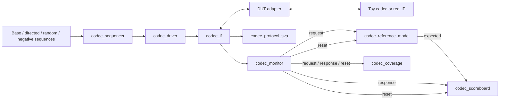
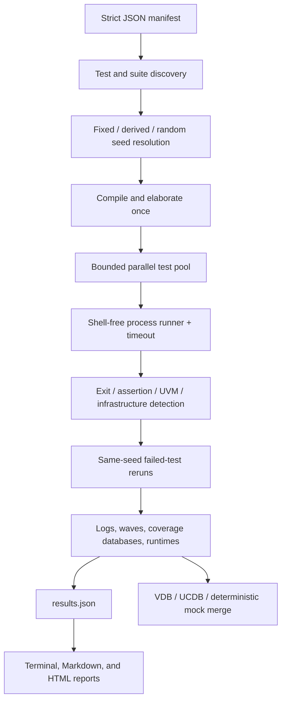

# Architecture and Integration Guide

## Design goals

The platform separates stable verification policy from replaceable codec and simulator details.
Transactions, checking, coverage intent, regression scheduling, and RL state semantics are reusable;
pin mapping, a real codec reference algorithm, vendor command syntax, and a future simulator-backed
RL service are explicit adapter boundaries.

The toy protocol is deliberately small enough to run without proprietary specifications while still
exercising configuration legality, frames and data, controls, deterministic output checking,
backpressure, latency, errors, reset recovery, and transaction ordering.

## SystemVerilog layers

### Protocol package and interface

`rtl/codec_protocol_pkg.sv` owns command, profile, frame, control, and status encodings plus helper
functions shared by the DUT and testbench. `tb/interfaces/codec_if.sv` is the physical verification
boundary. Its clocking blocks isolate drive and sample timing; its driver, monitor, and DUT modports
make signal direction explicit.

Requests carry one of four abstract operations:

- configuration: profile, width, height, bit depth, and quantization setting;
- frame metadata: frame type and metadata payload;
- input data: payload and valid byte count;
- control: start, flush, stop, or ping.

The interface also transports intentional error injection, programmable DUT latency, response
backpressure, response status/data, a sequence ID, and configured state. Only one transaction is
outstanding in the supplied model.

### DUT-specific boundary

`rtl/toy_codec.sv` is a synthesizable-style behavioral protocol model. It holds a valid response
stable under backpressure, applies configurable latency, numbers accepted requests, validates state
and fields, and returns deterministic status/data. The data path uses a rotate/XOR transform so a
reference model can predict output without describing a real compression format.

`tb/adapters/toy_codec_adapter.sv` is the toy-DUT pin mapping, and
`tb/adapters/toy_codec_reference_model.sv` contains its matching status/state/data predictor. The
codec-independent environment creates the `codec_reference_model` base through the UVM factory;
the separate `toy_codec_uvm_pkg` and `tb_top` install the toy predictor override without importing
toy code into `codec_uvm_pkg`. A real top can register a different predictor without editing
`codec_env`. If a real interface differs too much, replace the
interface/driver/monitor/adapter group but preserve the analysis transactions published by
`codec_agent`.

### Agent and configuration

`codec_seq_item` represents both stimulus and monitored observations. It includes configuration,
frame, data, control, error, latency, response-stall, inter-transaction-gap, reset, status, output,
sequence, and configured-state fields. Legal defaults are constrained; negative sequences opt in to
illegal values explicitly.

`codec_env_cfg` controls active/passive operation, transaction count, seeds, timeouts, feature
availability, backpressure, error injection, coverage, latency, response stalls, verbosity, and
waves. The active agent creates sequencer and driver; both active and passive modes retain the
monitor and its analysis ports.

The optional `CODEC_SEED` override drives a sequence-local deterministic stream. Every randomized
child item is explicitly seeded from that stream, and profile selection uses the same stream rather
than the simulator process RNG. Without the override, the simulator-native seed remains authoritative.

The driver applies reset, obeys request ready/valid, times out stalled requests/responses, can reset
during an outstanding request, and independently controls response-ready backpressure. The monitor
publishes cloned request, response, and reset observations; downstream components do not depend on
driver internals.

### Prediction and checking

The reference model consumes accepted requests in order and mirrors the toy codec's state machine,
status rules, sequence numbering, and data transform. It emits expected response items. Reset clears
pending prediction state and restarts the configured-state model.

The scoreboard compares expected and actual transactions for:

- sequence ID and command ordering;
- expected status and configured-state transitions;
- response data integrity and output correctness;
- explicit error responses and reset recovery;
- responses with no prediction and predictions with no response.

Its cycle watchdog consumes `scoreboard_timeout_cycles`, timestamps predictions with the monitor's
accepted-request cycle, preserves a response accepted on the timeout boundary, removes expired
predictions, and reports a distinct timeout before end-of-test missing-response checks. Reset clears
both predictions and age tracking.

Failures use distinct UVM IDs so regression log classification remains actionable.

### Assertions and coverage

`codec_protocol_sva` checks request and response persistence, stalled-signal stability, request and
response timeouts, one-outstanding ordering, configuration legality, state-dependent frame/data
traffic, reset outputs, and legal response encodings. The replaceable `toy_codec_state_sva` checks
the toy model's one-cycle configured-state transition timing; a real adapter can supply assertions
for its own state-publication latency. Negative tests
raise `tb_allow_illegal` only for transitions they intentionally exercise, preventing the checker
from hiding accidental protocol violations globally.

The functional collector samples accepted handshakes and reset events. It retains active
configuration and request context to cover profiles, resolution classes, frame types, bit depths,
quality, input size, controls, legality, errors, stalls, latency, reset, and focused crosses. The
closure rationale and known unreachable combinations are in `docs/coverage-plan.md`.

## Test architecture

All tests extend `codec_base_test`, which obtains the virtual interface, parses plusargs, validates
configuration, builds the environment, selects a sequence through a virtual factory method, and
manages the run-phase objection.

| Test | Sequence and intent |
|:--|:--|
| `codec_normal_test` | directed legal configure, frame/data, and control traffic |
| `codec_random_test` | feature-aware constrained-random configuration and traffic |
| `codec_backpressure_test` | variable latency and response-ready stalls |
| `codec_reset_recovery_test` | reset during active traffic, then reconfigure and recover |
| `codec_invalid_test` | invalid configuration/input/control and explicit error injection |

Corner primitives are reusable by future focused tests even when they are not a separately named
manifest test.

## Regression architecture

The runner validates the manifest before constructing commands. Each simulator adapter implements
compile, elaborate, test, and coverage-merge planning with argument tuples rather than shell
strings. Compilation/elaboration is shared for a run; test processes execute through a bounded
thread pool. Timeout handling terminates the child process and records the outcome instead of
pretending the test failed functionally.

The result schema distinguishes `real`, `mock`, and `dry_run` provenance and retains every attempt.
The final-attempt view drives exit status, rerun selection, terminal summaries, and reports. Dry run
never checks for tools or launches a subprocess. Tool unavailability is a separate outcome.

VCS and Questa consume the same test definitions. Icarus uses a separate RTL-only source manifest
and is intentionally restricted to the smoke flow. The mock adapter exercises orchestration and
reporting but is not an HDL simulator.

## Coverage flow

For a real VCS run, each covered test writes a VDB and `urg` receives all selected databases. For a
real Questa run, each covered test saves a UCDB, `vcover merge` combines them, and `vcover report`
generates HTML. The mock adapter writes deterministic JSON coverage artifacts and merges them to
exercise the complete pipeline locally. A dry-run merge records vendor commands without requiring
tools or databases.

Functional coverage lives in the UVM collector; code/assertion coverage options live in each
simulator's manifest entry. This separation lets a project tune vendor coverage without changing
test intent.

## RL integration boundary

The RL prototype does not import the UVM implementation. It depends on `CoverageBackend`, an
immutable snapshot/step contract with stable bin names and protocol state. The deterministic mock
backend implements that contract now. A future simulator adapter can batch or replay catalog actions
through UVM, then translate tool coverage into the same ordered binary observation.

The real backend must:

1. publish stable, unique bin names before an episode begins;
2. reset simulator and coverage state deterministically from a supplied seed;
3. translate a legal `CodecAction` into one or more UVM transactions;
4. return status, latency, timeout/infrastructure flags, protocol state, all covered bins, and the
   exact newly covered subset;
5. reject unknown bins and version any changed bin ordering or action vocabulary.

Compilation and simulator startup should normally be amortized across multiple actions or an entire
episode. A production bridge may use DPI, sockets, a transaction file, or batched regression jobs;
the backend contract does not mandate transport.

## Real-DUT migration checklist

1. Define real codec capabilities and map them to transaction fields.
2. Create a DUT adapter and update the source manifest.
3. Derive a predictor from `codec_reference_model`, register it through the UVM factory in the
   DUT-specific top, and implement the trusted reference algorithm there.
4. Map vendor/IP errors to stable expected status values.
5. Review reset, outstanding-transaction, backpressure, and ordering assumptions.
6. Extend sequences and coverage with target features and documented legal relations.
7. Review every SVA property against the physical interface timing contract.
8. Run the five baseline tests before adding stress traffic.
9. Merge functional, assertion, and code coverage and review documented unreachable bins.
10. Align RL capabilities/actions with the real SystemVerilog transaction vocabulary before adding
    a simulator-backed coverage service.

## Trust boundaries

The mock regression validates orchestration only. The mock RL backend validates state, mask, reward,
and learning integration only. Neither represents RTL execution or vendor coverage. A result is
treated as real only when a real adapter actually ran its required tools; missing tools, unsupported
flows, dry plans, timeouts, expected failures, and infrastructure failures remain distinct in JSON
and human-readable output.
